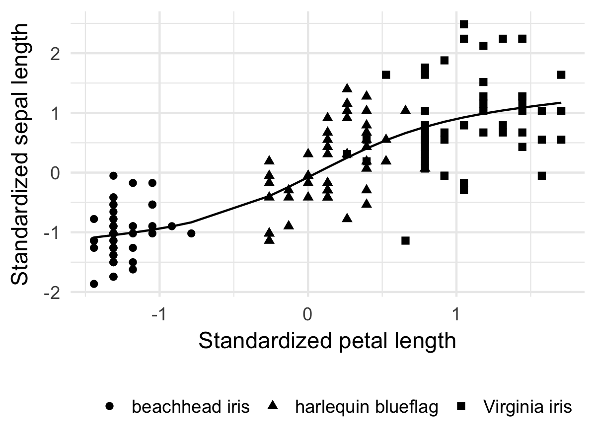

--- 
title: "Template manuscript"
author: "Oscar de Grouche, Jane Doe"
date: "`r format(Sys.Date(), '%B %d, %Y')`"
output:
  word_document:
    fig_caption: yes
  pdf_document:
    includes:
      latex_engine: pdflatex
    keep_tex: yes
csl: ecology.csl
bibliography: myrefs.bib
---

```{r setup, include=FALSE}
knitr::opts_chunk$set(echo = TRUE)
```

# Abstract

Abstract text would go here. 

# Introduction

This is an R Markdown document. Markdown is a simple formatting syntax for authoring HTML, PDF, and MS Word documents. For more details on using R Markdown see <http://rmarkdown.rstudio.com>.

When you click the **Knit** button a document will be generated that includes both content as well as the output of any embedded R code chunks within the document. You can **Knit** to PDF or to Microsoft word, just chose the appropriate dropdown from the **Knit** button. 

# Methods

You can make words **bold** with two asterisks, *italicized* with one.

## Data

Hashtags denote a header, and the hierarchy is defined by the number of hashtags. 

## Statistical Analysis

To make a floating equation, use two dollar signs on either side:

$$
\text{logit}(g_l) = \beta_{0g} + \beta_{1g}x_l.
$$

To make an in-line equation, use one dollar sign. As in this: $\alpha_\gamma^2$ for an example.

To make an equation array that shows up in both Word and PDF, you can use the following format:

\[
\begin{aligned}
R  &=  \text{the number of sightability trials (here }R = 124)\\
z_l &= \text{a random variable equal to 1 when the }l\text{th group is detected and 0 otherwise } (l = 1,2, \ldots, R)\\
x_l &= \text{the percent visual obstruction (from 0 to 1) associated with the }l\text{th group } (l = 1,2, \ldots, R)\\
g_l &= \text{the probability of detection of the }l\text{th group } (l = 1,2, \ldots, R)
\end{aligned}
\]

Remember to put ampersands (&) to align equations.

# Results

## Results sub-section

# Discussion 

You can cite references using the **citr** add-in. With **citr** you can cite papers in line like @Fieberg:2008 is fond of doing, or parenthetically [@R:2014]. You can also cite multiple sources at once [@Buckland:2015; @Fieberg:2008; @Plummer:2013]. References can be added into the myrefs.bib file directly, or created with BibTeX through LaTeX. 

# Figures

Figures can be included with the following code, but they must be in .png format to show up in both Word and PDF. They can be referenced for the PDF with Fig. \ref{figure1}. *Unfortunately, I don't yet know how to make the reference number show up in Word.*



# References